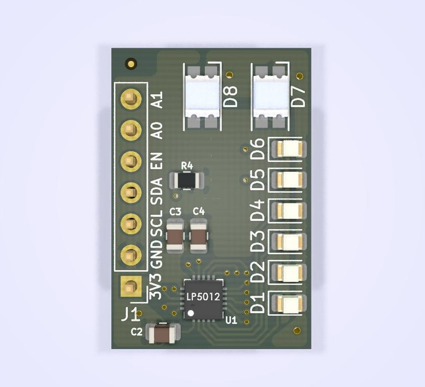
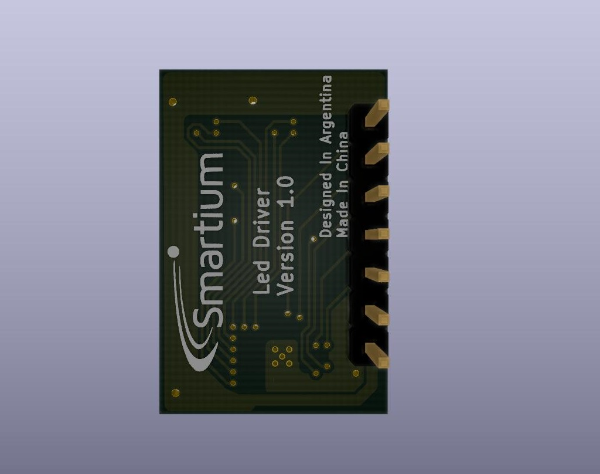

# TP Diseño de Circuitos Imprsos [CESE 8Co2019 DCI]
## Autor: Jhonattan Camargo
## Alumno revisor: Fabián Sarmiento
### Descripción del proyecto:

El proyecto consiste en la elaboración de uno de los módulos del proyecto final de carrera. El módulo incorpora el integrado LP5012 de Texas Instruments, el cual es un controlador de leds de 12 canales, controlado a través de I2C. El módulo que se propone para el TP final es una adaptación al módulo de evaluación de TI LP5012EVM (http://www.ti.com/lit/ug/slvubb2/slvubb2.pdf) adaptado para ocupar poco espacio e incoporar 2 LEDs RGB y 6 leds individuales.

El repositorio está organizado de la siguiente forma:
  
  - Directorio “doc”: contiene la explicación del circuito, licencia y las revisiones realizadas al diseño.
  - Directorio “info”: contiene hojas de datos, y toda la información relevante como fotos o notas de aplicación.
  - Directorio “pcb”: archivos del proyecto Kicad.
    - Subdirectorio “3dshapes”: contiene los modelos 3D.
   
   

### Renders del proyecto:

